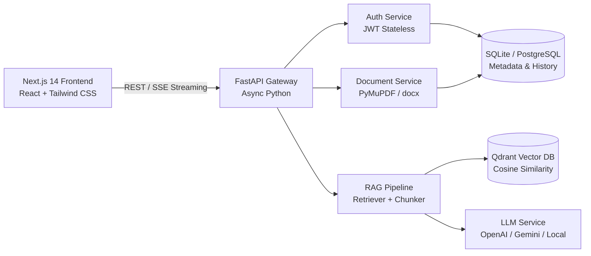

# 🎓 CampusMind — AI College Information Assistant

> **A Full-Stack Retrieval-Augmented Generation (RAG) Platform for College Inquiries with Verified Document Citations and Strict Zero-Hallucination Guardrails.**

---

## 📌 Table of Contents
1. [Overview & Solution](#-overview--solution)
2. [Key Features](#-key-features)
3. [Architecture & Tech Stack](#-architecture--tech-stack)
4. [Project Structure](#-project-structure)
5. [Prerequisites](#-prerequisites)
6. [Manual Step-by-Step Installation Guide](#-manual-step-by-step-installation-guide)
   - [Part 1: Backend Setup (FastAPI & Vector DB)](#part-1-backend-setup-fastapi--vector-db)
   - [Part 2: Database Initialization & Seeding](#part-2-database-initialization--seeding)
   - [Part 3: Frontend Setup (Next.js & Tailwind CSS)](#part-3-frontend-setup-nextjs--tailwind-css)
7. [Default Demo Accounts](#-default-demo-accounts)
8. [Sample Queries & Testing the RAG Pipeline](#-sample-queries--testing-the-rag-pipeline)
9. [API Endpoints & Swagger Docs](#-api-endpoints--swagger-docs)
10. [Troubleshooting & FAQs](#-troubleshooting--faqs)

---

## 🌟 Overview & Solution

Students and applicants frequently ask repetitive questions about **admissions, fee structures, scholarship criteria, hostel rules, exam policies, and campus placements**. Information is scattered across 50+ page PDFs, circulars, and notice boards.

**CampusMind** solves this by providing:
- **Instant, Grounded Q&A**: Ingests official institutional documents (PDF, DOCX, TXT) and indexes them in a dense vector database (Qdrant).
- **Page-by-Page Grounded Citations**: Every answer provides the exact document name, page number, similarity match score, and text excerpt.
- **Strict Hallucination Prevention**: If a question falls below the similarity threshold or is not in college records, CampusMind explicitly states the information is unavailable rather than fabricating answers.
- **Role-Based Document Management**: Administrators can upload, reprocess, and purge documents with instant vector re-indexing.

---

## 🚀 Key Features

| Feature | Description |
| :--- | :--- |
| **Real-Time Streaming Chat** | Token-by-token response streaming using Server-Sent Events (SSE) for minimal latency. |
| **Persistent History** | Multi-session conversation history per user with search and deletion capabilities. |
| **Interactive Grounding Viewer** | Modal dialog showing the cited snippet in full context with 1-click download of the original file. |
| **Topic Categorization** | Filter inquiries across *Admissions*, *Fees*, *Hostel*, *Exams*, and *Placements*. |
| **Admin Document Ingestion** | Drag-and-drop file upload with automatic text extraction, chunking, embedding, and indexing. |
| **Analytics Dashboard** | Live KPI cards, query volume trends, category distribution, and satisfaction tracking (👍/👎). |
| **Super Admin Security** | Role management (Student / Admin / Super Admin) and immutable audit log tracking. |

---

## 🛠️ Architecture & Tech Stack



- **Frontend**: Next.js 14 (App Router), React 18, TypeScript, Tailwind CSS, Lucide Icons
- **Backend API**: FastAPI (Python 3.10+), Uvicorn, Pydantic v2
- **Vector Database**: Qdrant (Embedded local storage or Qdrant Cloud)
- **Relational Database**: SQLite (default zero-config) or PostgreSQL via SQLAlchemy 2.0 (Async)
- **Embeddings & LLM**:
  - *Primary*: OpenAI `text-embedding-3-small` / `gpt-4o-mini`
  - *Alternative*: Google Gemini `gemini-1.5-flash`
  - *Offline Fallback*: Built-in semantic embedding & grounded synthesis engine (zero external API keys required for testing)

---

## 📁 Project Structure

```
My_Project/
├── backend/
│   ├── app/
│   │   ├── main.py                     # FastAPI application entrypoint & middleware
│   │   ├── seed.py                     # DB & Vector knowledge base seeding script
│   │   ├── api/                        # REST API route controllers
│   │   │   ├── auth.py                 # Signup, login, refresh, logout
│   │   │   ├── chat.py                 # Query streaming, conversations, feedback
│   │   │   ├── documents.py            # Upload, list, delete, reprocess, download
│   │   │   └── admin.py                # Analytics, user management, audit logs
│   │   ├── core/                       # App configurations & security
│   │   │   ├── config.py               # Pydantic environment settings
│   │   │   ├── security.py             # Password hashing (bcrypt) & JWT handling
│   │   │   └── dependencies.py         # Auth & role-based route guards
│   │   ├── db/                         # Database models & vector client
│   │   │   ├── models.py               # SQLAlchemy schema definitions
│   │   │   ├── session.py              # Async engine & session lifecycle
│   │   │   └── vector_client.py        # Qdrant client wrapper
│   │   ├── rag/                        # RAG ingestion & extraction
│   │   │   ├── extractor.py            # PDF/DOCX/TXT text parsing
│   │   │   ├── chunker.py              # Sentence-aware recursive chunker
│   │   │   ├── retriever.py            # Similarity search & threshold filtering
│   │   │   ├── prompt_templates.py     # System instructions & anti-hallucination prompts
│   │   │   └── llm_client.py           # LLM connector (OpenAI / Gemini / Local)
│   │   ├── schemas/                    # Pydantic request & response models
│   │   └── services/                   # Business logic layer
│   ├── sample_docs/                    # Pre-packaged official college documents
│   ├── uploads/                        # Document file storage directory
│   ├── .env.example                    # Environment variable template
│   └── requirements.txt                # Python backend dependencies
│
├── frontend/
│   ├── app/                            # Next.js 14 App Router pages
│   │   ├── page.tsx                    # Landing page with hero & live RAG preview
│   │   ├── layout.tsx                  # Root layout with global styling & toasts
│   │   ├── globals.css                 # Tailwind directives & design tokens
│   │   ├── (auth)/
│   │   │   ├── login/page.tsx          # Login with 1-click demo accounts
│   │   │   └── signup/page.tsx         # Account registration
│   │   ├── chat/page.tsx               # Real-time streaming chat & sidebar
│   │   ├── admin/
│   │   │   ├── dashboard/page.tsx      # Analytics & KPI overview
│   │   │   ├── documents/page.tsx      # Document upload & vector management
│   │   │   └── users/page.tsx          # Super Admin role controls & audit logs
│   │   ├── profile/page.tsx            # User profile & session details
│   │   └── not-found.tsx               # Custom 404 page
│   ├── components/                     # Modular React UI components
│   │   ├── chat/                       # Message bubbles, source cards, modals
│   │   ├── admin/                      # Charts, document tables, user tables
│   │   └── shared/                     # Sticky navbar, sidebar, toast alerts
│   ├── lib/                            # API client & auth session helpers
│   └── package.json                    # Node dependencies & build scripts
│
└── README.md                           # Documentation & setup guide
```

---

## 💻 Prerequisites

Ensure the following tools are installed on your machine:
- **Python**: Version `3.10`, `3.11`, or `3.12` ([Download Python](https://www.python.org/downloads/))
- **Node.js**: Version `18.x` or `20.x` LTS + **npm** ([Download Node.js](https://nodejs.org/))
- **Git**: (Optional, for repository management)

---

## 📖 Manual Step-by-Step Installation Guide

### Part 1: Backend Setup (FastAPI & Vector DB)

#### 1. Open your terminal and navigate to the backend directory:
```powershell
# Windows PowerShell
cd c:\Users\Administrator\OneDrive\Desktop\My_Project\backend
```

#### 2. Create and activate a Python virtual environment:
```powershell
# Create virtual environment
python -m venv venv

# Activate virtual environment on Windows (PowerShell):
.\venv\Scripts\Activate.ps1

# (If using Windows Command Prompt - cmd):
# .\venv\Scripts\activate.bat

# (If using macOS / Linux):
# source venv/bin/activate
```

#### 3. Install required Python packages:
```powershell
pip install --upgrade pip
pip install -r requirements.txt
```

#### 4. Configure Environment Variables:
Copy the example configuration file:
```powershell
# Windows PowerShell
Copy-Item .env.example .env

# macOS / Linux
# cp .env.example .env
```

*(Optional)* If you have an OpenAI or Gemini API key, you can open `.env` in any editor and add it:
```ini
OPENAI_API_KEY="your-openai-api-key-here"
# OR
GEMINI_API_KEY="your-gemini-api-key-here"
```
> **Note**: If left blank, CampusMind will automatically use its internal deterministic semantic embedding and local grounded answer generator, allowing full offline testing without API costs!

---

### Part 2: Database Initialization & Seeding

Run the seed script to automatically initialize the SQLite database tables and ingest the 5 official sample documents into the Qdrant vector store:

```powershell
# Make sure your virtual environment is active
python app/seed.py
```

**What this script does:**
1. Creates the database tables (`users`, `documents`, `document_chunks`, `conversations`, `messages`, `feedback`, `audit_logs`).
2. Creates default demo accounts (**Student**, **Admin**, **Super Admin**).
3. Reads, chunks, embeds, and indexes the 5 official sample documents from `sample_docs/`.
4. Seeds an initial sample conversation with page citations.

---

### Part 3: Running the Backend Server

Start the FastAPI application with Uvicorn:

```powershell
uvicorn app.main:app --reload --host 127.0.0.1 --port 8000
```

- **API Base URL**: `http://127.0.0.1:8000`
- **Interactive Swagger Documentation**: [http://127.0.0.1:8000/docs](http://127.0.0.1:8000/docs)
- **Health Check**: [http://127.0.0.1:8000/api/health](http://127.0.0.1:8000/api/health)

---

### Part 4: Frontend Setup (Next.js & Tailwind CSS)

#### 1. Open a **new terminal window** and navigate to the `frontend` folder:
```powershell
cd c:\Users\Administrator\OneDrive\Desktop\My_Project\frontend
```

#### 2. Install Node dependencies:
```powershell
npm install
```

#### 3. Start the Next.js development server:
```powershell
npm run dev
```

#### 4. Open the Web Application:
Open your browser and navigate to:
👉 **[http://localhost:3000](http://localhost:3000)**

---

## 👥 Default Demo Accounts

For fast evaluation, the login screen provides **1-Click Demo Buttons** or you can log in manually with the following credentials:

| Role | Email Address | Password | Privileges |
| :--- | :--- | :--- | :--- |
| 🧑‍🎓 **Student** | `student@campusmind.edu` | `Password123!` | Ask questions, stream responses, view citations, chat history, submit 👍/👎 feedback. |
| 👨‍💼 **Admin** | `admin@campusmind.edu` | `Password123!` | All student features + Document Upload (PDF/DOCX), Vector Reprocessing, Analytics Dashboard. |
| 🛡️ **Super Admin** | `superadmin@campusmind.edu` | `Password123!` | All admin features + User Role Management (Promote/Demote) & Security Audit Logs. |

---

## 🔍 Sample Queries & Testing the RAG Pipeline

Once logged in, navigate to **[http://localhost:3000/chat](http://localhost:3000/chat)** and test these grounded inquiries:

### 1. Admissions & Eligibility
> **Query**: *"What is the minimum eligibility criteria and last application date for B.Tech Computer Science?"*  
> **Expected Grounding**: Cites `Admissions_Brochure_2026.txt`, Page 1 (75% aggregate in 10+2 PCM, deadline June 15, 2026).

### 2. Tuition Fees & Scholarships
> **Query**: *"What is the annual fee for B.Tech CSE and what merit scholarships are offered?"*  
> **Expected Grounding**: Cites `Fee_Structure_and_Scholarships_2026.txt`, Pages 1 & 3 ($12,500 annual fee, President's 100% waiver, Dean's 50% waiver).

### 3. Hostel Regulations
> **Query**: *"What are the hostel curfew timings and what electrical appliances are prohibited?"*  
> **Expected Grounding**: Cites `Hostel_Rules_and_Mess_Regulations_2026.txt`, Pages 1 & 2 (9:30 PM curfew, electric heaters/irons strictly prohibited).

### 4. Academic Policies & Exam Attendance
> **Query**: *"What is the minimum attendance requirement to sit for end-semester examinations?"*  
> **Expected Grounding**: Cites `Academic_Calendar_and_Examination_Policy_2026.txt`, Page 2 (Mandatory 75% minimum attendance).

### 5. Campus Placement Report
> **Query**: *"What was the highest international and domestic package in the 2026 placement report?"*  
> **Expected Grounding**: Cites `Placement_Report_and_Recruitment_Guidelines_2026.txt`, Page 1 ($145,000 international, $52,000 domestic).

### 6. Zero-Hallucination Fallback Test
> **Query**: *"Can I bring a pet parrot into the college hostel?"*  
> **Expected Grounding**: Displays the distinctive **Amber Fallback Notice**: *"I cannot find information regarding this in the official college records. Please reach out to the relevant department."*

---

## 📡 API Endpoints & Swagger Docs

The backend exposes a full REST API with interactive documentation accessible at `http://127.0.0.1:8000/docs`:

### Authentication (`/api/auth`)
- `POST /api/auth/signup` — Register a new student or admin account
- `POST /api/auth/login` — Authenticate and receive JWT access + refresh tokens
- `POST /api/auth/refresh` — Refresh expired access token
- `POST /api/auth/logout` — Invalidate user session
- `GET  /api/auth/me` — Get current logged-in user profile

### Chat & RAG (`/api/chat`)
- `POST /api/chat/query` — Submit inquiry (supports both standard JSON and SSE streaming via `stream=true`)
- `GET  /api/chat/conversations` — List user's past conversations
- `GET  /api/chat/conversations/{id}` — Fetch conversation message history and cited source cards
- `DELETE /api/chat/conversations/{id}` — Delete conversation
- `POST /api/chat/feedback` — Submit 👍 / 👎 rating and comments on answers

### Document Management (`/api/documents`)
- `POST   /api/documents/upload` — Upload PDF/DOCX/TXT with category & department metadata
- `GET    /api/documents` — List indexed documents with chunk counts & status
- `GET    /api/documents/{id}` — Get single document metadata
- `PUT    /api/documents/{id}` — Update title, category, or department
- `DELETE /api/documents/{id}` — Delete document and purge its vectors from Qdrant
- `POST   /api/documents/{id}/reprocess` — Re-extract, re-chunk, and re-embed document vectors
- `GET    /api/documents/{id}/download` — Download original uploaded file

### Admin & Analytics (`/api/admin`)
- `GET   /api/admin/analytics` — KPI metrics, query volumes, category distributions, satisfaction rates
- `GET   /api/admin/users` — List registered users and query statistics
- `PATCH /api/admin/users/{id}/role` — Update user role (`student`, `admin`, `super_admin`)
- `GET   /api/admin/audit-logs` — Administrative security audit logs

---

## ❓ Troubleshooting & FAQs

### 1. Backend Port Conflict (`Port 8000 already in use`)
If port 8000 is occupied by another process, run Uvicorn on an alternative port:
```powershell
uvicorn app.main:app --reload --port 8080
```
Then update `NEXT_PUBLIC_API_URL` in `frontend/.env.local` or `frontend/lib/api.ts` to `http://127.0.0.1:8080`.

### 2. PowerShell Script Execution Policy
If you get an error when running `.\venv\Scripts\Activate.ps1`:
```powershell
Set-ExecutionPolicy -ExecutionPolicy RemoteSigned -Scope CurrentUser
```

### 3. Re-indexing after Uploading New Documents
When you upload a new document in the Admin Dashboard (`/admin/documents`), it is automatically processed in real time. If needed, click the **"Reprocess Vectors"** icon next to any document to force a re-index.

---

## 📄 License
CampusMind is built for academic and institutional deployment under the MIT License.
