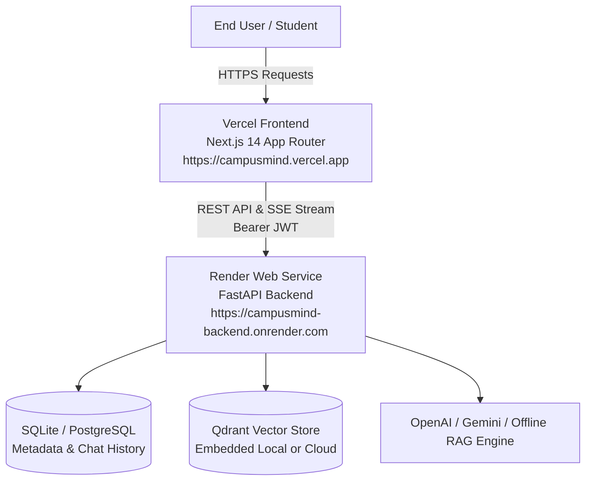

# 🚀 Complete Deployment Guide: Render (Backend) + Vercel (Frontend)

This guide walks you step-by-step through pushing your **CampusMind** project to GitHub, deploying the **FastAPI + RAG Backend** on [Render](https://render.com), and deploying the **Next.js 14 Frontend** on [Vercel](https://vercel.com).

---

## 🏗️ Architecture Overview



---

## 📋 Table of Contents
1. [Step 1: Push Project to GitHub](#step-1-push-project-to-github)
2. [Step 2: Deploy Backend on Render](#step-2-deploy-backend-on-render)
3. [Step 3: Deploy Frontend on Vercel](#step-3-deploy-frontend-on-vercel)
4. [Step 4: Configure Production CORS](#step-4-configure-production-cors)
5. [Step 5: Post-Deployment Verification](#step-5-post-deployment-verification)
6. [Troubleshooting Common Deployment Issues](#troubleshooting-common-deployment-issues)

---

## Step 1: Push Project to GitHub

Make sure you are in the root directory (`My_Project`) containing both `backend/` and `frontend/` folders.

### 1. Initialize Git repository and commit code:
```powershell
# Open terminal in root folder (My_Project)
git init
git add .
git commit -m "feat: complete CampusMind RAG college assistant with Next.js frontend and FastAPI backend"
```

### 2. Create a new repository on GitHub:
1. Go to [GitHub.com](https://github.com) and click **New repository**.
2. Name the repository: `campusmind` (or any name you prefer).
3. Keep it **Public** or **Private** (Render and Vercel support both).
4. Do **NOT** initialize with a README (we already created one).
5. Click **Create repository**.

### 3. Push your code to GitHub:
```powershell
# Rename branch to main
git branch -M main

# Link to your GitHub repository (replace with your actual GitHub URL)
git remote add origin https://github.com/YOUR_USERNAME/campusmind.git

# Push code to GitHub
git push -u origin main
```

---

## Step 2: Deploy Backend on Render

[Render](https://render.com) provides managed cloud hosting for Python/FastAPI web services.

### 1. Sign in to Render:
- Go to [https://render.com](https://render.com) and log in (or sign up with GitHub).

### 2. Create a New Web Service:
1. On the Render Dashboard, click the **New +** button (top right) and select **Web Service**.
2. Select **Build and deploy from a Git repository** and connect your `campusmind` repository.

### 3. Configure the Web Service Settings:

| Setting | Value | Notes |
| :--- | :--- | :--- |
| **Name** | `campusmind-backend` | Will generate URL: `https://campusmind-backend.onrender.com` |
| **Region** | *Choose closest to your location* | (e.g. Oregon, Frankfurt, Singapore) |
| **Branch** | `main` | |
| **Root Directory** | `backend` | ⚠️ **Crucial**: Sets the working directory to `backend/` |
| **Runtime** | `Python 3` | |
| **Build Command** | `pip install -r requirements.txt && python app/seed.py` | Installs dependencies and seeds knowledge base |
| **Start Command** | `uvicorn app.main:app --host 0.0.0.0 --port $PORT` | Starts FastAPI on dynamic Render port |
| **Instance Type** | `Free` (or Starter) | Free tier provides 512MB RAM |

### 4. Add Environment Variables on Render:
Scroll down to the **Environment Variables** section and add:

| Key | Value | Description |
| :--- | :--- | :--- |
| `ENV` | `production` | Production mode |
| `DEBUG` | `false` | Disable debug logs |
| `PYTHON_VERSION` | `3.11.8` | Recommended Python version |
| `JWT_SECRET` | `campusmind-production-jwt-secret-9988772211` | Secret key for JWT auth (use random string) |
| `CORS_ORIGINS` | `["*"]` | Allows initial connections; update with Vercel URL in Step 4 |
| `OPENAI_API_KEY` | *(optional)* `sk-...` | Add if using OpenAI GPT-4o-mini |
| `GEMINI_API_KEY` | *(optional)* `AIza...` | Add if using Google Gemini |

> 💡 **Offline Mode Supported**: If you do not provide `OPENAI_API_KEY` or `GEMINI_API_KEY`, CampusMind automatically uses its built-in deterministic semantic embedding and local grounded answer synthesis.

### 5. Click "Create Web Service":
- Render will start building the backend.
- The build log will show `pip install`, database initialization, and sample document vector ingestion (`seed.py`).
- When deployment finishes, status will turn **Live** 🟢.
- **Copy your backend URL**: e.g., `https://campusmind-backend.onrender.com`.

### 6. Verify Backend Deployment:
Open the following in your browser:
- Health check: `https://campusmind-backend.onrender.com/api/health`
- Interactive API Docs: `https://campusmind-backend.onrender.com/docs`

---

## Step 3: Deploy Frontend on Vercel

[Vercel](https://vercel.com) provides seamless hosting for Next.js applications with global edge caching.

### 1. Sign in to Vercel:
- Go to [https://vercel.com](https://vercel.com) and log in with your GitHub account.

### 2. Import your GitHub Repository:
1. Click **Add New...** -> **Project**.
2. Find and click **Import** next to your `campusmind` repository.

### 3. Configure the Vercel Project:

1. **Project Name**: `campusmind` (or `campusmind-app`)
2. **Framework Preset**: `Next.js` (automatically detected)
3. **Root Directory**: Click **Edit** and select `frontend` ⚠️ **(Essential!)**
4. **Build and Output Settings**: Leave as default (`npm run build`, output `.next`)

### 4. Set Frontend Environment Variables:
Under **Environment Variables**, add:

| Key | Value | Notes |
| :--- | :--- | :--- |
| `NEXT_PUBLIC_API_URL` | `https://campusmind-backend.onrender.com` | **Use your exact Render backend URL** (without trailing slash `/`) |

### 5. Click "Deploy":
- Vercel will build the Next.js frontend in ~45 seconds.
- When done, you will see the **"Congratulations!"** screen with your live production URL:  
  👉 **`https://campusmind.vercel.app`** (or your assigned domain).

---

## Step 4: Configure Production CORS

For production security and smooth cross-origin cookie / SSE streaming:

1. Go back to your [Render Dashboard](https://dashboard.render.com).
2. Click on your `campusmind-backend` service -> **Environment**.
3. Edit the `CORS_ORIGINS` variable to include your Vercel frontend URL:
   ```json
   ["https://campusmind.vercel.app","http://localhost:3000","http://127.0.0.1:3000"]
   ```
4. Click **Save Changes** (Render will automatically apply the changes without downtime).

---

## Step 5: Post-Deployment Verification

Now test your deployed live application end-to-end:

### 1. Open Your Deployed Website:
Navigate to your Vercel URL (e.g. `https://campusmind.vercel.app`).

### 2. Test Student Q&A:
1. Click **Sign In** -> Click the **Student** 1-click demo button (or enter `student@campusmind.edu` / `Password123!`).
2. Go to the Chat interface.
3. Submit inquiry: *"What is the annual fee for B.Tech CSE and what scholarships are offered?"*
4. Verify that:
   - Response streams in real time.
   - Exact source card `Fee_Structure_and_Scholarships_2026.txt, Page 1` appears.
   - Clicking the source card opens the **Document Grounding Modal** and download link.

### 3. Test Admin Document Ingestion:
1. Sign in as Admin (`admin@campusmind.edu` / `Password123!`).
2. Navigate to **Document Management** (`/admin/documents`).
3. Drag and drop any new PDF/DOCX or TXT circular.
4. Watch the document process and index into Qdrant in real-time.
5. Immediately ask the chatbot a question from your newly uploaded document.

### 4. Test Super Admin Control:
1. Sign in as Super Admin (`superadmin@campusmind.edu` / `Password123!`).
2. Open **User Management** (`/admin/users`) to view user accounts, change roles, and inspect security audit logs.

---

## 🛠️ Troubleshooting Common Deployment Issues

### Issue 1: Render Free Tier "Cold Starts"
- **Symptom**: First request after 15 minutes of inactivity takes 30-50 seconds to respond.
- **Cause**: Render free tier puts inactive web services into sleep mode.
- **Solution**: Once the first request loads, subsequent queries are instantaneous (< 1s). For 24/7 zero-sleep, upgrade to Render Starter tier ($7/mo) or use a free uptime monitor (e.g., UptimeRobot) to ping `https://campusmind-backend.onrender.com/api/health` every 10 minutes.

### Issue 2: Frontend shows "Request failed / Network Error"
- **Symptom**: Chat query shows network error on Vercel.
- **Fix**:
  1. Check that `NEXT_PUBLIC_API_URL` in Vercel has **no trailing slash** (e.g., `https://campusmind-backend.onrender.com` not `https://campusmind-backend.onrender.com/`).
  2. Verify that `CORS_ORIGINS` in Render contains your Vercel domain.
  3. Verify backend is live by opening `https://campusmind-backend.onrender.com/docs` in your browser.

### Issue 3: Missing `frontend` Root Directory in Vercel
- **Symptom**: Vercel build fails with "No package.json found".
- **Fix**: In Vercel Project Settings -> General -> Root Directory -> Click **Edit** -> Set to `frontend` -> Redeploy.

### Issue 4: Persistent File Storage on Render Free Tier
- **Note**: Render Free tier uses an ephemeral filesystem. If your service restarts, newly uploaded PDFs in `/uploads` are reset. The pre-seeded sample documents are automatically re-seeded on build via `seed.py`.
- **Production Option**: For permanent persistent storage of uploaded PDFs in production, attach an AWS S3 / Cloudflare R2 bucket or Render Persistent Disk.

---

## 🏁 Summary Checklist

- [x] `.gitignore` configured to keep secrets and `node_modules` out of Git.
- [x] Code pushed to GitHub repository (`main` branch).
- [x] Render Web Service created with Root Directory `backend`.
- [x] Render Build Command: `pip install -r requirements.txt && python app/seed.py`.
- [x] Render Start Command: `uvicorn app.main:app --host 0.0.0.0 --port $PORT`.
- [x] Vercel Project created with Root Directory `frontend`.
- [x] Vercel `NEXT_PUBLIC_API_URL` set to Render backend URL.
- [x] Render `CORS_ORIGINS` updated with Vercel production domain.
